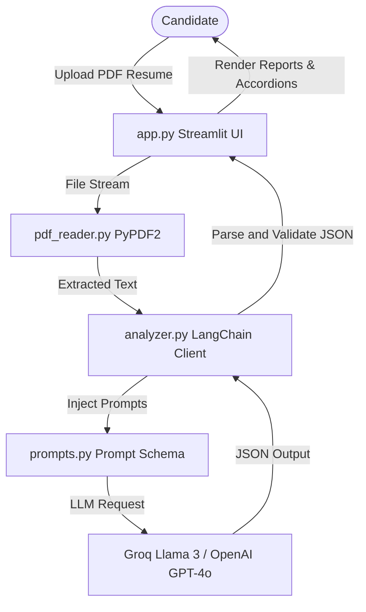

# AI Resume Analyzer & ATS Coach 💼

A professional-grade, modular capstone AI application that acts as a 24/7 technical recruiter. The tool evaluates uploaded resumes, awards a health score, detects technical and soft skills, audits ATS scanner compliance, exposes keyword gaps, recommends roles, and lists step-by-step improvement actions.

Built using **Streamlit**, **LangChain**, **Groq LLM** (primary), **OpenAI** (fallback), and **PyPDF2**.

---

## Project Overview

In competitive job markets, resumes are first scanned by automated Applicant Tracking Systems (ATS) and then reviewed by technical recruiters for less than 10 seconds. This application serves candidates by simulating this evaluation workflow using state-of-the-art LLMs. The app parses PDF text, assesses keyword relevance, detects structure issues, and suggests actionable text edits.

---

## Features

1. **Multi-Provider LLM Integration**: Run evaluations using **Groq** (`llama-3.3-70b-specdec` for ultra-fast performance) or **OpenAI** (`gpt-4o-mini`).
2. **Interactive Health Score**: Custom circular metric visualizer reflecting resume readability and completeness.
3. **Structured Competency Audit**: Exposes detected technical languages, developer tools, frameworks, soft skills, and leadership methodologies.
4. **ATS Parser Diagnostics**: Flags formatting hazards (multiple columns, icons, tables) that can break automated company parsers.
5. **Keyword Gap Checker**: Compiles relevant terms that are absent from the resume but highly expected in the industry.
6. **Career Path Recommendation**: Suggests suitable job titles based on experience profile.
7. **Actionable Recommendations**: Numerical step-by-step feedback to optimize formatting, metric definitions, and phrasing.

---

## Folder Structure

```
resume_analyzer/
├── app.py                  # Streamlit frontend application and layout widgets
├── analyzer.py             # LangChain client connector and JSON parsing logic
├── pdf_reader.py           # PyPDF2 text extraction and integrity checker
├── prompts.py              # Recruiter persona prompt templates
├── requirements.txt        # Package dependencies and version pins
├── README.md               # User guide, architecture overview, and deployment docs
├── .env.example            # Environment variables template
├── .gitignore              # Git ignore rules
├── assets/                 # Folder for assets (e.g., logo)
├── screenshots/            # UI preview placeholders
├── report/                 
│   └── reflection.md       # Capstone project reflection report
└── demo/                   # Demo files and links
```

---

## Architecture Diagram



---

## Technologies Used

- **Streamlit**: Application structure and custom CSS rendering.
- **LangChain**: LLM client calling, prompts framing, and streaming output parsers.
- **Groq API**: High-speed llama open-weight execution.
- **OpenAI API**: Robust fallback GPT processing.
- **PyPDF2**: PDF text extractor.
- **Python-dotenv**: Config loading.

---

## Installation

### 1. Set Up Environment
Navigate to the project root in your command shell:
```bash
cd "Assignment 7/resume_analyzer"
```

### 2. Formulate Virtual Environment
```bash
python3 -m venv venv
source venv/bin/activate  # On Windows: venv\Scripts\activate
```

### 3. Load Dependencies
```bash
pip install -r requirements.txt
```

---

## Environment Variables

1. Copy `.env.example` to configure local variables:
   ```bash
   cp .env.example .env
   ```
2. Enter your API credentials in `.env`:
   ```env
   LLM_PROVIDER=groq
   GROQ_API_KEY=your_groq_api_key_here
   OPENAI_API_KEY=your_openai_api_key_here
   ```

*Note: You can also specify credentials directly in the sidebar of the Streamlit dashboard during execution.*

---

## Running the Project

Run this terminal command to launch the app:
```bash
streamlit run app.py
```
This opens the web browser automatically at `http://localhost:8501`.

---

## Streamlit Community Cloud Deployment

This capstone project is deployment-ready for Streamlit Community Cloud:

1. **Push to GitHub**: Make sure this folder is committed to a GitHub repository.
2. **Sign in to Streamlit Cloud**: Access [share.streamlit.io](https://share.streamlit.io/) using your GitHub account.
3. **Deploy App**:
   - Repository: Select your GitHub repo.
   - Branch: `main`
   - Main file path: `Assignment 7/resume_analyzer/app.py`
4. **Define Secrets**: In the Advanced Settings of Streamlit Cloud, paste the environment credentials under **Secrets**:
   ```toml
   GROQ_API_KEY = "your_actual_groq_key"
   OPENAI_API_KEY = "your_actual_openai_key"
   LLM_PROVIDER = "groq"
   ```
5. **Launch**: Click **Deploy** and your app will be online!

---

### Deployed Link: https://deploy-debug26.streamlit.app/

---

## Screenshots

 


---

## Future Improvements

- **RAG Job Description Alignment**: Allow candidates to paste job listings to assess match percent.
- **Font & Formatting Scanners**: Inspect margins, layout columns, and font sizes using layout-aware libraries.
- **Auto-Rewrite Suggestions**: Allow users to click a weakness and get an AI-generated sentence replacement.
